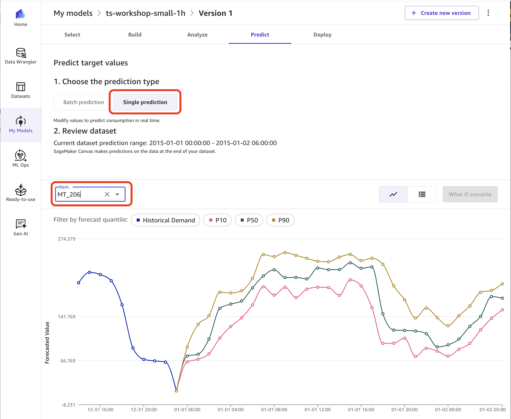
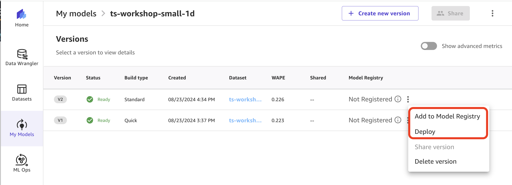

# Time Series forecasting with AWS services

## Overview
This project demonstrates how to use AWS services to implement time series forecasting. It covers the following examples and AWS services:
1. Amazon SageMaker Canvas
2. Amazon SageMaker Autopilot API
3. Amazon SageMaker DeepAR
4. Chronos
5. AutoGluon
6. Amazon SageMaker notebooks
7. Amazon QuickSight forecast

## Getting started
To run the notebooks in this project you must use [SageMaker Studio](https://aws.amazon.com/sagemaker/studio/) which requires a [SageMaker domain](https://docs.aws.amazon.com/sagemaker/latest/dg/studio-entity-status.html).

If you'd lke to create a new domain, you can follow the onboarding [instructions](https://docs.aws.amazon.com/sagemaker/latest/dg/gs-studio-onboard.html) in the Developer Guide or use the provided AWS CloudFormation [template]() that creates a SageMaker domain, a user profile, and adds the IAM roles required for executing the provided notebooks.

## Datasets

1. For Canvas: `consumer_electronics`
2. For Autopilot
3. For SageMaker DeepAR
4. For Chronos

## Example 1: Amazon SageMaker Canvas
[Amazon SageMaker Canvas](https://docs.aws.amazon.com/sagemaker/latest/dg/canvas.html)

Time series forecast model
`consumer_electronics.csv` dataset

Canvas time series model training uses the [Sagemaker Autopilot](https://docs.aws.amazon.com/sagemaker/latest/dg/autopilot-automate-model-development.html), which enables the use of various Autopilot’s public APIs. These include operations like `CreateAutoMLJobV2`, `ListCandidatesForAutoMLJob`, and `DescribeAutoMLJobV2` among others. This integration facilitates a streamlined process for training machine learning models directly within the Canvas environment.

[Time series forecasting algorithms](https://docs.aws.amazon.com/sagemaker/latest/dg/timeseries-forecasting-algorithms.html)

### Experiment 1
**Quick build mode**

In quick build mode Canvas trains one model. The model and metrics are captured in SageMaker Experiments.

See Experiments in Studio Classic:

Predict:

To generate predictions after you build a model in Canvas, Canvas automatically deploys an asynchronous SageMaker endpoint into your AWS account. The endpoint is temporary and Canvas uses it to generate single prediction. For batch predictions, Canvas starts a SageMaker batch transform job. The endpoint deployed by Canvas can be used only for in-app predictions and cannot be used outside Canvas.

### Experiment 2
**Standard build mode**

Customizing model build:

In standard build mode Canvas trains the [six built-in algorithms]((https://docs.aws.amazon.com/sagemaker/latest/dg/timeseries-forecasting-algorithms.html)) with your target time series. Then, using a stacking ensemble method, it combines these model candidates to create an optimal forecasting model for a given objective metric.

All models and metrics are captured in SageMaker experiments.

See Experiments in Studio Classic:

Predict:

### Model deployment
Currently Canvas doesn't support model deployment to SageMaker from the UX. To deploy the trained model as a SageMaker real-time endpoint or use it in batch transform outside of Canvas UX, you can use any of two options:

- [Autopilot model deployment and forecasts](https://docs.aws.amazon.com/sagemaker/latest/dg/timeseries-forecasting-deploy-models.html)
- boto3 Python SDK as shown in Section 4 of the [Time series Forecasting with Amazon SageMaker Autopilot](https://github.com/aws/amazon-sagemaker-examples/blob/main/autopilot/autopilot_time_series.ipynb) notebook

To keep your model in a central model registry you can register the model directly from Canvas UX:

Canvas also shows the model package details:

You can now use "Model package group name" to have access to a model version via boto3 API.

### Resources
- [Time Series Forecasts in Amazon SageMaker Canvas](https://docs.aws.amazon.com/sagemaker/latest/dg/canvas-time-series.html)

## Example 2: Amazon SageMaker Autopilot API

Note: previous Autopilot UX in Studio Classic merged with Canvas as of re:Invent 2023. All AutoML functionality is moved to Canvas as of now.

Existing content:
- [Amazon SageMaker Autopilot](https://docs.aws.amazon.com/sagemaker/latest/dg/autopilot-automate-model-development.html)
- [Time series forecasting algorithms in SageMaker](https://docs.aws.amazon.com/sagemaker/latest/dg/timeseries-forecasting-algorithms.html)
- Example notebook [Time series Forecasting with Amazon SageMaker Autopilot](https://github.com/aws/amazon-sagemaker-examples/blob/main/autopilot/autopilot_time_series.ipynb)
- [Lab 2 - Demand Forecasting with SageMaker Autopilot API](https://catalog.us-east-1.prod.workshops.aws/workshops/caef4710-3721-4957-a2ce-33799920ef72/en-US/40-sagemakerautopilot)

## Example 3: Amazon SageMaker DeepAR

Existing content:
- [Use the SageMaker DeepAR forecasting algorithm](https://docs.aws.amazon.com/sagemaker/latest/dg/deepar.html)
- [Deep AR Forecasting](https://sagemaker.readthedocs.io/en/stable/algorithms/time_series/deep_ar.html)
- [Example notebook](https://github.com/aws/amazon-sagemaker-examples/blob/main/introduction_to_amazon_algorithms/deepar_electricity/DeepAR-Electricity.ipynb)

## Example 4: Chronos

Chronos models on HF
Use SageMaker Studio notebook

Existing content:
- [Chronos models on Huggingface](https://huggingface.co/amazon/chronos-t5-large)
- [Chronos GitHub](https://github.com/amazon-science/chronos-forecasting)
- [Chronos: Learning the Language of Time Series](https://arxiv.org/html/2403.07815v1)
- [Adapting language model architectures for time series forecasting](https://www.amazon.science/blog/adapting-language-model-architectures-for-time-series-forecasting)

## Example 5: AutoGluon

Existing content:
- [AutoGluon time series forecasting](https://auto.gluon.ai/stable/tutorials/timeseries/index.html)

- AutoGluon time series
- AutoGluon Chronos
    - [AutoGluon forecasting with Chronos](https://auto.gluon.ai/stable/tutorials/timeseries/forecasting-chronos.html)
    - [Forecasting with Chronos notebook Colab](https://colab.research.google.com/github/autogluon/autogluon/blob/stable/docs/tutorials/timeseries/forecasting-chronos.ipynb)

AutoGluon-TimeSeries (AG-TS) now features [Chronos](https://github.com/amazon-science/chronos-forecasting), a family of pretrained time series forecasting models. Chronos models are based on language model architectures, and work by quantizing time series into buckets which are treated as tokens. Language models are then trained on these token sequences using cross-entropy loss.

The current iteration of Chronos models, [available](https://www.google.com/url?q=https%3A%2F%2Fhuggingface.co%2Famazon%2Fchronos-t5-large) on Hugging Face 🤗, is based on the T5 architecture and was trained on a large corpus of open-source time series data augmented with synthetic data generation techniques. The Chronos [paper](https://www.google.com/url?q=https%3A%2F%2Farxiv.org%2Fabs%2F2403.07815) provides greater detail about the models and how they were trained.

AG-TS provides a robust and easy way to use Chronos through the familiar `TimeSeriesPredictor` API.

- Chronos can be combined with other forecasting models to build accurate ensembles using the `"high_quality"` and `"best_quality"` presets.
- Alternatively, Chronos can be used as a standalone zero-shot model with presets such as `"chronos_small"` or `"chronos_base"`.

## Example 6: Amazon SageMaker

Existing content:
- [Robust time series forecasting with MLOps on Amazon SageMaker](https://aws.amazon.com/blogs/machine-learning/robust-time-series-forecasting-with-mlops-on-amazon-sagemaker/)
- [Deep demand forecast with Amazon SageMaker](https://github.com/awslabs/sagemaker-deep-demand-forecast)

## Example 7: Amazon QuickSight forecast
[Amazon QuickSight](https://docs.aws.amazon.com/quicksight/latest/user/welcome.html) has ML features to give you hidden insights and trends in your data. One of these ML features is **ML-powered forecast**. The built-in ML forecast uses [Random Cut Forest (RCF) algorithm](https://docs.aws.amazon.com/quicksight/latest/user/concept-of-ml-algorithms.html) to detect seasonality, trends, exclude outliers, and impute missing values. For more details on how QuickSight uses  RCF to generate forecasts, see the [developer guide](https://docs.aws.amazon.com/quicksight/latest/user/how-does-rcf-generate-forecasts.html).

Flow this step-by-step guide to create a QuickSight dashboard and a forecast for a dataset in `/data` folder of this repository:

1. To create a dataset in QuickSight from a new data source, provide connection information to the data source. You can imported the dataset directly from the local disk
2. Create a new analysis and visual
3. On the QuickSight start page, choose **Analyses**, and then choose **New analysis**.
4. Choose the dataset that you want to include in your new analysis, and then choose **Use in Analysis** in the top right.
5. In the New sheet pop-up that appears, choose the Interactive sheet, tiled layout.
6. Choose add and create visual.
7. Choose the Line chart of a visual type from the Visual types pane.
8. Use the column `ts` as X AXIS. We created the monthly demand forecasting for the all items
9. Drag the column `demand` as value
10. On the menu in the upper-right corner of the visual, choose the Menu options icon (the three dots), and then choose **Add forecast**. 

    QuickSight automatically analyzes the historical data using ML, and displays a graphical forecast for the next N periods. Forecast properties apply to all items in the visual. If you want individual forecasts for each store, consider creating a separate visual for each it and adding a forecast.

10. You can add filter to the visual. choose **Filter** on the element settings menu,  then choose to view filters. Add `item_id` as the filter field. 
11. Publish the visual as new dashboard. Make sure you enabled **ad-hoc filtering** in Advanced publish options

The forecasting filtered on `item_101` and `store_001` will look like below:

You can customize multiple settings on the **Forecast properties** pane, such as number of forecast periods, prediction interval, seasonality, and forecast boundaries.

For more details refer to the Developer Guide [Forecasting and creating what-if scenarios with Amazon QuickSight](https://docs.aws.amazon.com/quicksight/latest/user/forecasts-and-whatifs.html).

Besides a graphical forecasting, you can also add a forecast as a narrative in an insight widget. To learn more, see [Creating autonarratives with Amazon QuickSight](https://docs.aws.amazon.com/quicksight/latest/user/narratives-creating.html).

## Results and comparison

TBD: add qualitative/quantitative comparison of model performance, add a summary tables across multiple services

[Evaluating Predictor Accuracy](https://docs.aws.amazon.com/forecast/latest/dg/metrics.html)

## Resources

### Algorithms
- [References for machine learning and RCF](https://docs.aws.amazon.com/quicksight/latest/user/learn-more-about-machine-learning-and-rcf.html)
- [Chronos forecasting GitHub repository](https://github.com/amazon-science/chronos-forecasting)
- [Adapting language model architectures for time series forecasting](https://www.amazon.science/blog/adapting-language-model-architectures-for-time-series-forecasting)
- [Chronos: Learning the Language of Time Series](https://arxiv.org/pdf/2403.07815.pdf)
- [AutoGluon](https://github.com/autogluon/autogluon)
- [AutoGluon Time series forecasting](https://auto.gluon.ai/stable/tutorials/timeseries/index.html)

### Blog posts
- [Robust time series forecasting with MLOps on Amazon SageMaker](https://aws.amazon.com/blogs/machine-learning/robust-time-series-forecasting-with-mlops-on-amazon-sagemaker/)
- [Deep demand forecasting with Amazon SageMaker](https://aws.amazon.com/blogs/machine-learning/deep-demand-forecasting-with-amazon-sagemaker/)
- [Capture public health insights more quickly with no-code machine learning using Amazon SageMaker Canvas](https://aws.amazon.com/blogs/machine-learning/capture-public-health-insights-more-quickly-with-no-code-machine-learning-using-amazon-sagemaker-canvas/)
- [Speed up your time series forecasting by up to 50 percent with Amazon SageMaker Canvas UI and AutoML APIs](https://aws.amazon.com/blogs/machine-learning/speed-up-your-time-series-forecasting-by-up-to-50-percent-with-amazon-sagemaker-canvas-ui-and-automl-apis/)

### Workshops and notebooks
- [Time series forecasting with AWS services workshop](https://catalog.us-east-1.prod.workshops.aws/workshops/caef4710-3721-4957-a2ce-33799920ef72/en-US)
- [Time series Forecasting with Amazon SageMaker Autopilot](https://github.com/aws/amazon-sagemaker-examples/blob/main/autopilot/autopilot_time_series.ipynb)

---

Copyright Amazon.com, Inc. or its affiliates. All Rights Reserved.
SPDX-License-Identifier: MIT-0